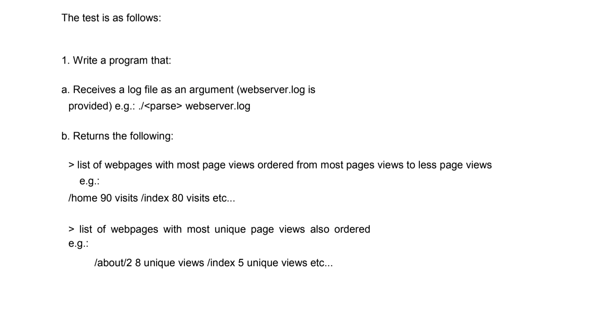

# Smart Pesion

I was contacted by a recruiter for the postion of Junior Ruby on Rails Developer
for a company called `Smart Pension` which I turned down.

I did however get their tech test and thought I'd have a go at it in Ruby.

## Requirements

## Solution

I found this one to be quite easy. I used each solution in previous projects so knew what to do.
The source can be found in the lib file.

## TDD and coverage

I sort of spiked the code and went back to make the tests. Naughty I know, but I figured it's ok since it's such a small one.
